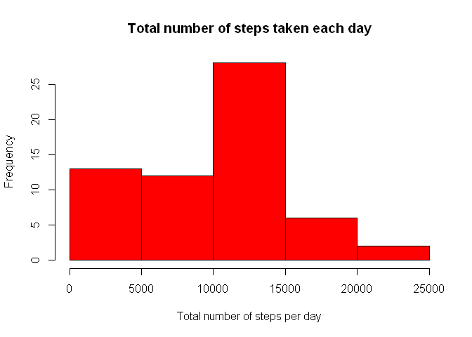
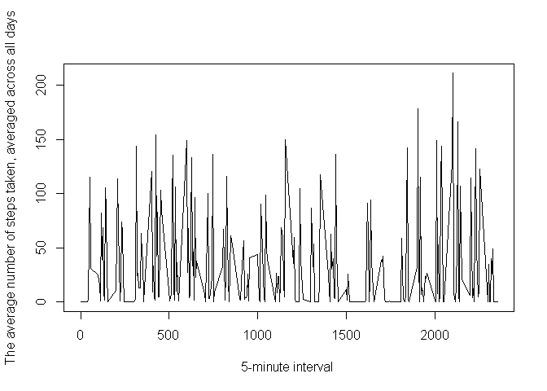

# Reproducible Research: Peer Assessment 1


## Loading and preprocessing the data


```r
data<-read.csv("activity.csv")
```

## What is mean total number of steps taken per day?
### A histogram of the total number of steps taken each day

```r
subdata<-data$steps
for (i in 1:17568){
  if(is.na(subdata[i])){
    subdata[i]<-0
  }
}
subdatasum<-c()
for (i in 1:61){
  k<-1+(i-1)*60*24/5
  l<-i*60*24/5
  subdatasum[i]<-sum(subdata[k:l])
}
hist(subdatasum, col="red",main="Total number of steps taken each day", xlab="Total number of steps per day")
```

 

### Mean and median total number of steps taken per day

```r
summary(subdatasum)
```

```
##    Min. 1st Qu.  Median    Mean 3rd Qu.    Max. 
##       0    6778   10400    9354   12810   21190
```
Mean total number of steps taken per day is 9354.  
Median total number of steps taken per day is 10400.  


## What is the average daily activity pattern?


```r
subcols<-colMeans(array(subdata,c(61,288)))
plot(data$interval[1:288],subcols,type = "l",lty=1,xlab="5-minute interval ",ylab="The average number of steps taken, averaged across all days")
```

 


The maximum number of steps on average contains interval 2105  


## Imputing missing values


```r
summary(data)
```

```
##      steps                date          interval     
##  Min.   :  0.00   2012-10-01:  288   Min.   :   0.0  
##  1st Qu.:  0.00   2012-10-02:  288   1st Qu.: 588.8  
##  Median :  0.00   2012-10-03:  288   Median :1177.5  
##  Mean   : 37.38   2012-10-04:  288   Mean   :1177.5  
##  3rd Qu.: 12.00   2012-10-05:  288   3rd Qu.:1766.2  
##  Max.   :806.00   2012-10-06:  288   Max.   :2355.0  
##  NA's   :2304     (Other)   :15840
```

The total number of missing values in the dataset is 2304.  


## Are there differences in activity patterns between weekdays and weekends?
